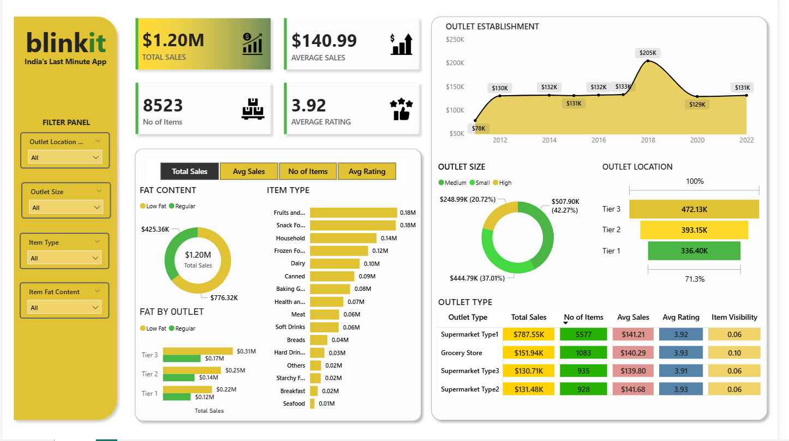

# 🛒 Blinkit Retail Sales & Performance Analytics Dashboard

## 📊 Project Overview

This project presents an interactive sales and performance analytics dashboard built using Power BI, inspired by retail operations similar to Blinkit (India's last-minute delivery platform).

The dashboard provides a comprehensive view of sales performance, customer preferences, outlet distribution, and product-level insights to support data-driven decision-making.

---

## 🎯 Objectives

* Analyze total sales performance across different outlet types and locations
* Identify top-performing product categories and item types
* Understand the impact of outlet size and tier on revenue
* Evaluate customer preferences based on fat content and item visibility
* Deliver an intuitive, interactive dashboard for business stakeholders

---

## 🧰 Tools & Technologies

* **Power BI Desktop** – Data visualization and dashboard creation
* **Microsoft Excel / CSV** – Data source
* **DAX (Data Analysis Expressions)** – Measures and calculations
* **Data Cleaning & Transformation** – Power Query

---

## 📁 Dataset Description

The dataset contains retail-related information including:

* Item Type (e.g., Fruits, Snacks, Dairy, Frozen Foods)
* Fat Content (Low Fat / Regular)
* Outlet Size (Small, Medium, High)
* Outlet Location Tier (Tier 1, Tier 2, Tier 3)
* Sales, Ratings, and Item Visibility

---

## 📈 Key Metrics (KPIs)

* **Total Sales:** $1.20M
* **Average Sales:** $140.99
* **Number of Items:** 8,523
* **Average Rating:** 3.92

---

## 📊 Dashboard Features

### 🔹 Sales Analysis

* Total and average sales overview
* Sales trends based on outlet establishment year
* Comparative analysis across outlet types

### 🔹 Product Insights

* Sales distribution by item type
* Category-level performance (e.g., Fruits, Snacks, Household items)
* Fat content analysis (Low Fat vs Regular)

### 🔹 Outlet Performance

* Sales by outlet tier (Tier 1, Tier 2, Tier 3)
* Outlet size contribution (Small, Medium, High)
* Outlet type comparison (Supermarket vs Grocery Store)

### 🔹 Customer Insights

* Average rating distribution
* Item visibility impact on sales
* Consumer preference trends

### 🔹 Interactive Filters

Users can dynamically filter data based on:

* Outlet Location
* Outlet Size
* Item Type
* Fat Content

---

## 📸 Dashboard Preview

---

## 🚀 Key Insights

* Tier 3 outlets generated the highest sales contribution
* Medium-sized outlets contributed the largest share of revenue
* Low-fat products slightly outperformed regular products in total sales
* Fruits and snack foods emerged as top-selling categories
* Supermarket Type 1 dominated overall sales performance

---

## 💡 Business Impact

This dashboard helps stakeholders:

* Optimize inventory and product placement
* Identify high-performing locations and outlet types
* Improve customer satisfaction through data insights
* Make strategic decisions based on sales patterns

---

## ▶️ How to Use

1. Download the `.pbix` file from this repository
2. Open using Power BI Desktop
3. Use filters to explore different business scenarios

---

## 📌 Future Improvements

* Integration with real-time data sources
* Advanced forecasting using time-series models
* Customer segmentation and predictive analytics

---

## 📎 Repository Contents

* `Blinkit_Sales_Dashboard.pbix` – Power BI file
* `BlinkIT_Grocery_Data.csv` – Source data
* `Blinkit_Dashboard.png` – Dashboard preview

---

## 🙋‍♂️ Author

Jayendar A

---

## ⭐ If you found this project useful, feel free to star the repository!
